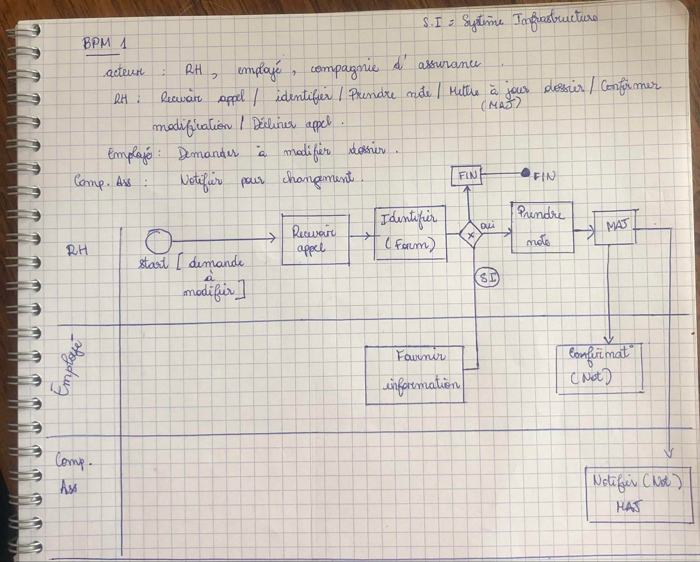

# Système de Gestion des Processus Métier (BPM)

Ce projet implémente un système de gestion des processus métier (BPM) basé sur une architecture de microservices. Il permet de gérer les demandes de modification de dossiers des employés, les notifications et les validations, en intégrant les rôles du RH, de l'employé et de la compagnie d'assurance.

Le projet est composé de 5 microservices principaux :

* **Gestion des Appels** : Gère les appels des employés demandant des modifications de dossiers.
* **Gestion des Dossiers** : Gère les dossiers des employés et leurs mises à jour.
* **Gestion des Requêtes** : Gère les requêtes de modification de dossiers soumises par les employés.
* **Notification** : Gère les notifications envoyées aux employés et à la compagnie d'assurance.
* **Validation** : Gère les validations des requêtes par le RH.

L'architecture est basée sur une passerelle API centralisée (`app.js`) qui orchestre les microservices. Chaque microservice a sa propre base de données (MySQL) et communique avec les autres microservices via des requêtes HTTP.

Diagramme BPM

Installation
1-Cloner le dépôt :
git clone <URL_du_dépôt>
cd <nom_du_dépôt>

2-Installer les dépendances :
Pour chaque microservice (gestion_appels, gestion_dossiers, gestion_requetes, notification, validation), exécutez :
cd <nom_du_microservice>
npm install
cd ..

À la racine du projet, exécutez :
npm install

3-Configurer les variables d'environnement :

Créez un fichier .env à la racine du projet avec les variables d'environnement suivantes :

PORT=3002
DB_HOST=localhost
DB_USER=votre_utilisateur
DB_PASSWORD=votre_mot_de_passe
DB_DATABASE=nom_de_votre_base_de_données

Créez des fichiers .env dans chaque microservice avec les variables d'environnement spécifiques à chaque microservice (si nécessaire).

4-Créer les bases de données et les tables :

Créez les bases de données MySQL et les tables nécessaires pour chaque microservice en utilisant les schémas fournis dans les modèles de données.

# Démarrage des microservices

1-Démarrer les microservices :

Pour chaque microservice, exécutez :

cd <nom_du_microservice>
npm run dev
cd ..

À la racine du projet, exécutez :
npm run dev

2-Accéder à l'API :
Pour celui de la gestion des requêtes, notification et validation, l'API est accessible à l'adresse http://localhost:3002/api. pour celui de la gestion des requêtes, notification et validation
Pour celui de la gestion des appels ou la gestion des dossiers, vous devriez configurer votre fichier .env pour specifier vos choix

# Points importants

Chaque microservice a sa propre base de données MySQL:
1-Gestion des Appels avec gestion_appels.sql
2-Gestion des Dossiers avec gestion_dossiers.sql
3-Gestion des Requêtes, Notification et Validation avec requetes_notification_validation.sql

Les microservices communiquent via des requêtes HTTP.
La passerelle API centralise les routes de tous les microservices.
Les données sensibles (informations de connexion à la base de données) sont stockées dans des variables d'environnement.

# Membres du Groupe 
RANDRIAMIHAJARIVO Ambinintsoa Nancy
RAZY-RAZAKABOANA Masy Andrianina
RAMANDIMBINIRINA Mandresy Michel
RABEVAHOAKA Liantsoa